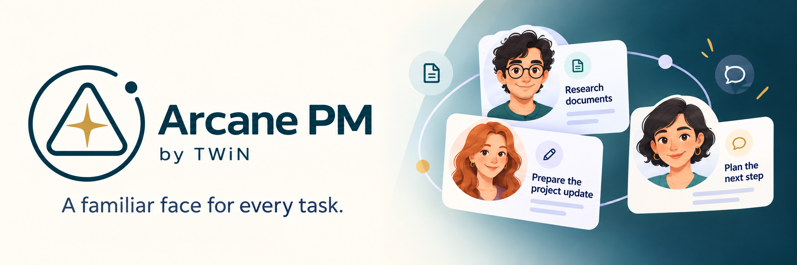
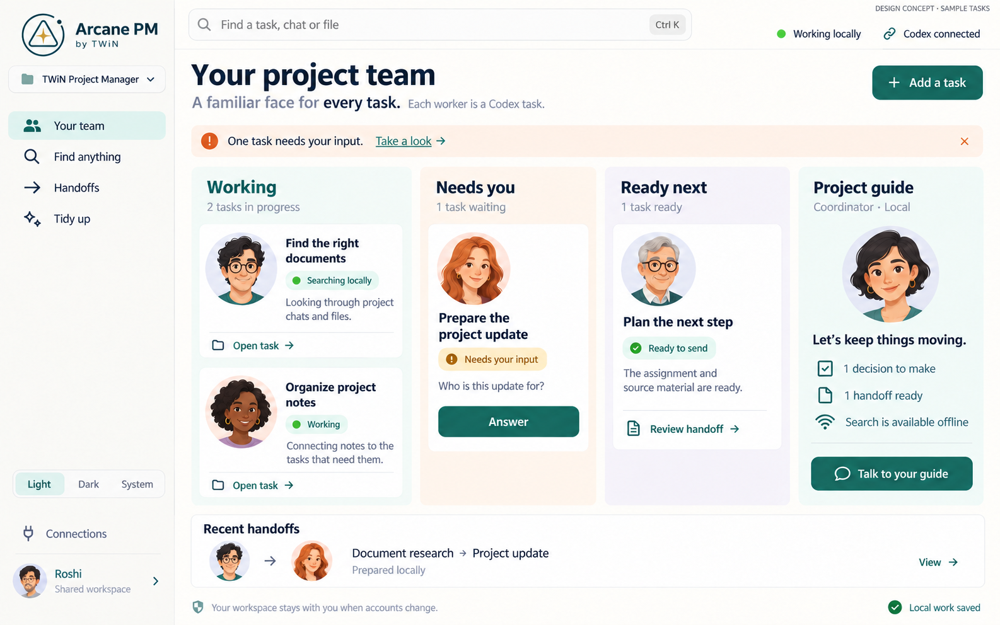
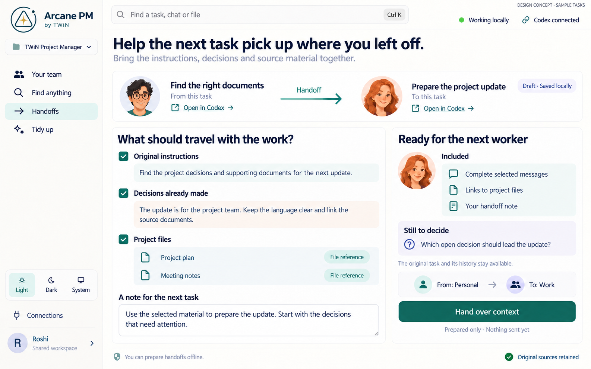
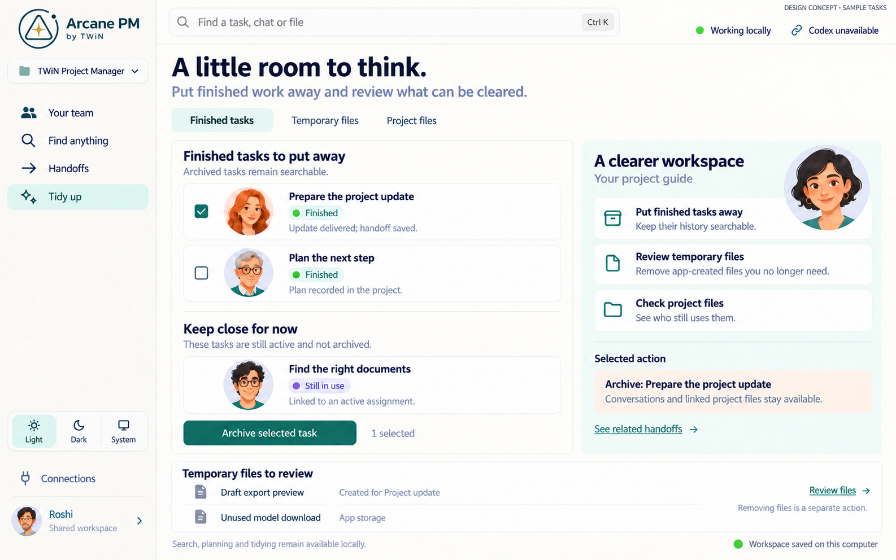

# Arcane PM

A welcoming workspace for organizing Codex projects, finding prior work, and preparing the next step. Each task has a familiar face, making a growing project easier to follow.

**In development.** These images illustrate the intended experience using sample tasks. They do not demonstrate working integrations. Integration availability will be documented as app functionality is delivered.

## Meet your project team

See which tasks are working, need your attention, or are ready for their next assignment. A project guide coordinates the work, while each task keeps a link to its original Codex conversation.

<picture>
  <source media="(prefers-color-scheme: dark)" srcset="docs/images/arcane-pm-team-dark.png">
  
</picture>

## Find it, then carry it forward

The planned local search brings together tasks, task conversations, and working files without spending Codex tokens. Complete original sources remain available to read.

A context handoff collects the assignment, decisions, open questions, selected original messages, and file references. A prepared note supplements those sources. Preparing a handoff and sending it are distinct steps.

See the context-handoff design

## Keep preparing locally

Local Jev and supported local models are intended to help with research, organization, tooling, and preparing work for Codex. Codex handles demanding assignments when a connection and tokens are available. Optional DigitalOcean serverless inference provides another remote provider when selected.

Offline preparation relies on locally available files, records, and installed models. App-owned orchestration can stay with the workspace across account switches; Codex account access and native conversations remain governed by their own account connections.

## Make room for the next step

Archive completed tasks while keeping their history searchable. Review disposable app files separately from working documents and active assignments.

See the tidy-up design

## Built to fit your project

The intended npm package will provide reusable project-management functionality and UI components, so teams can build their own interfaces. A decoupled bridge separates project orchestration from Codex and local runtime connections.

Application data and model assets belong in DBOPFS. Working files stay in their selected system project folders. Application source remains at the repository root; the intentionally public marketing site and developer docs belong in `site/`.

The application uses plain HTML, CSS, and JavaScript with the published `arcane-os` SDK, declared as `latest` during development. From this repository's root, run `npm i`, then `npm run dev`, and open `http://127.0.0.1:4310/index.html`. See [local development and browser packaging](site/docs/concepts.html#run-locally) for the PWA configuration, generated files, and selected package commands.

The browser PWA implementation is available; actual browser installation remains unverified. Native Codex access, native ONNX execution, and native image generation require the running Arcane PM host. The static PWA does not supply that host. The private application package is `arcane-pm-app`; the public reusable npm package, its installation contract, and callable API remain separate work.

On Windows, run `npm run build:windows` to build the native application. Close the existing packaged app normally before rebuilding. The workflow retains one completed app under `build/windows-x64/` and records its location in `build/windows-x64/current.json`. A replacement uses temporary build staging; successful completion removes the older app and staging, while a failed replacement preserves the previous completed app and removes its partial output. User profiles, saved data, models, and reusable runtime caches remain in their existing locations. Complete build diagnostics are saved under `output/foundation/`.

A successful build establishes the selected package result. Connection behavior, window presentation, and other native interactions require acceptance in that packaged app; a browser preview establishes only its own behavior.

The native `pm.modelContext.current` method returns `{workingDirectory}` for
temporary model projections. It resolves `model-working` under the actual
`stateRoot` supplied to the service by the published SDK launch context. Image
and decision preparation use this one app-owned location through the SDK model
asset service. DBOPFS remains the original model store, and the SDK owns each
projection's preparation, engine use and release. This method reads the launch
context without creating, moving or cleaning any stored files.

The Windows application exposes the SDK's app-scoped control endpoint at
`\\.\pipe\arcane-pm-control`. With the built application running, use
`arcane app-control status --endpoint '\\.\pipe\arcane-pm-control'` or
`connectAppControl` from `arcane-os/core/app-control` for status, document
inspection, viewport capture, and targeted DOM actions. Use the document
generation returned by inspection for each action and inspect its actual
result. Use the returned `shadowPath` to inspect or act within an open component
shadow root, including the shared appearance control. The connection preserves the application's existing Core, origin,
profile, and window; closing the controller leaves the application running.
See the [published app-control API](https://github.com/TheWizardNexus/arcane-os-sdk/blob/0.83.0/docs/reference/native-app-control.md).

## Explore the designs

The public site uses focused pages rather than a long scrolling landing page, with matching light, dark, and mobile layouts.

[Project design instructions](AGENTS.md) map the approved references to each surface and describe the required comparison before visual delivery.

- [Marketing home — light](docs/images/arcane-pm-home-light.png) · [dark](docs/images/arcane-pm-home-dark.png) · [mobile](docs/images/arcane-pm-home-mobile.png)
- [Developer docs — light](docs/images/arcane-pm-docs-light.png) · [dark](docs/images/arcane-pm-docs-dark.png) · [mobile](docs/images/arcane-pm-docs-mobile.png)
- [Arcane PM brand — light and dark](docs/images/arcane-pm-brand.png)

[Image-generation prompts](docs/designs/image-prompts.md) record the static design brief and reference direction.

Arcane PM is a TWiN project designed to work with Codex.
